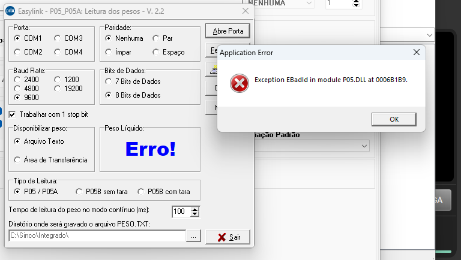
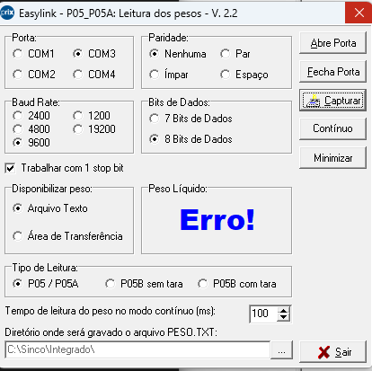
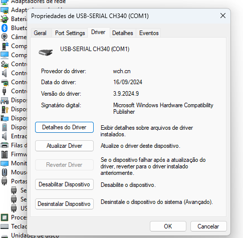

# Case Study: Real-World Bug Resolution & Root Cause Analysis (RCA)
## 📂 Case Studies Index (Índice de Casos)

Here you will find a curated list of production issues, technical breakdowns, and infrastructure recoveries documented with full root cause analysis (RCA).

| Case ID | Technical Title | Core Technology | Severity | Documentation Link |
| :--- | :--- | :--- | :--- | :--- |
| **#001** | POS Integration & Handshake Bug | Windows Serial / CH340 / DLL | High 🔴 | [View Case Study](README.md) |
| **#002** | Production Database Corruption Recovery | Firebird SQL / Gfix / Gbak | Critical 🚨 | [View Case Study](firebird-database-recovery.md) |
| **#003** | System Migration & Extended Network Errors | Windows 11 / Network Mapping | Medium 🟡 | *Coming Soon* |

---

> [!NOTE]
> 📝 **Contexto em Português:** Este repositório documenta um caso real de produção (restaurante em plena operação). Foi realizada a investigação de causa raiz para um erro de comunicação serial (`Exception EBadId` na `P05.DLL`), resolvido através do downgrade do driver do chip CH340 para restabelecer a operação da balança Toledo Prix 3 Fit.

  
  
  

## Overview

This repository documents a real-world technical failure involving hardware-software integration, automated operating system updates, and legacy protocol compatibility. It serves as a practical demonstration of **Root Cause Analysis (RCA)**, **Log Investigation**, and **Compatibility Testing** applied to production environments.

* **System/Module:** Easylink Integration V. 2.2 (Sinco Ecosystem)
* **Hardware Component:** Toledo Prix 3 Fit Scale (USB-SERIAL CH340 Converter - COM Port)
* **Error Token:** `Exception EBadId in module P05.DLL`
* **Impact:** **High** 🔴 (Complete block on the Point of Sale weighment operations)

---

## 🔍 Problem Description

Following a preventive motherboard replacement on a checkout terminal, the **Easylink** automation module lost the ability to communicate with the **Toledo Prix 3 Fit** scale. Although physical connections were intact and the operating system detected the peripheral, the POS software failed to open the COM port, causing an immediate crash or failure when operators attempted to weigh goods.

---

## Steps to Reproduce

1. Connect the Toledo Prix 3 Fit scale to the native COM/USB port of the newly installed motherboard.
2. Allow Windows Update to automatically detect and assign the communication driver.
3. Launch the POS Facilite system and activate the Easylink background service.
4. Attempt to trigger a weighment event from the cashier terminal interface.
5. Observe the communication timeout/error.

---

## Discovered Results

### ❌ Actual Result (The Bug)
The automation software fails to map and process streams from the serial port. When the user interacts with the terminal, the system raises a critical memory/identity exception: `Exception EBadId in module P05.DLL at 0006B1B9` 
and flags a hardcoded "Erro!" message inside the weight field UI, preventing any telemetry data from being saved into the local ledger file (`C:\Sinco\Integrado\PESO.TXT`).

### ✅ Expected Result
The POS software must transparently hook into the assigned serial COM port, complete the handshake protocol, and reliably capture data packets streamed by the Toledo hardware, regardless of physical infrastructure refactoring.

---

## Root Cause Analysis (RCA)

The dynamic link library `P05.DLL` used by Easylink V. 2.2 expects a structured bitstream configuration back from the physical device. 

Following a system refactor, Windows Update forcefully deployed the **WCH.CN USB-SERIAL CH340 Driver (Version 3.9.2024.9 / Date: 16/09/2024)**. This specific modern iteration changes the internal timing and data buffer processing for serial-to-USB handshakes, returning an unhandled hardware profile identifier that crashes the underlying Delphi application layer.

---

## Workaround & Resolution Applied

Instead of attempting a software patch or full ecosystem upgrade, the issue was mitigated directly at the OS environment layer:

1. **Device Isolation:** Opened Windows **Device Manager** (`devmgmt.msc`) and targeted the specific COM port associated with the Toledo scale.
2. **Driver Overriding:** Triggered `Update Driver` ➡️ `Browse my computer for drivers` ➡️ `Let me pick from a list of available drivers on my computer`.
3. **Manual Rollback (Downgrade):** Forced the system to revert from the automated Microsoft cloud version to the localized, legacy certified driver version.
4. **Service Cycle:** Recycled the Easylink process environment.

> **Final Verification Status:** The COM port linked instantly with the local service, achieving **100% data fidelity** on weight data capture during regression checks.

---

## Hard Skills Demonstrated in this Case

* **Root Cause Analysis (RCA):** Shifting from generic trial-and-error troubleshooting to precise log investigation to narrow down the single point of failure (Driver regression).
* **Compatibility & Interoperability Testing:** Validating how low-level OS environment shifts break older legacy systems in complex, multi-vendor environments.
* **Infrastructure Hazard Mitigation:** Effectively rolling back software dependencies safely in production under operational pressure with zero data corruption.

