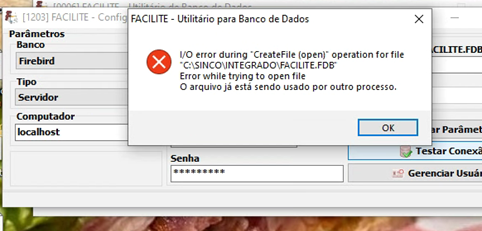
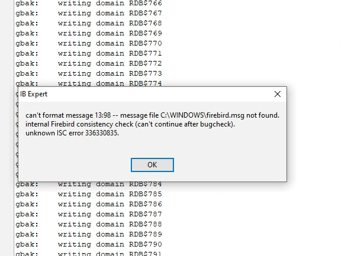
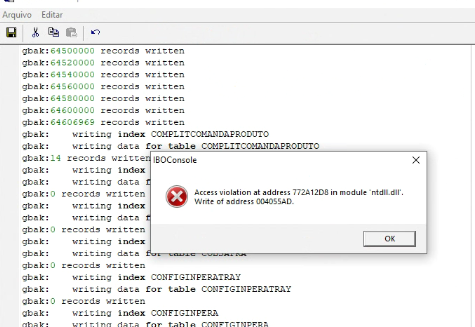

# 🗄️ Case Study: Production Database Corruption Recovery (Firebird SQL)

<p align="center">
  
  
  
</p>

> [!NOTE]
> 📝 **Contexto em Português:** Este caso documenta a recuperação crítica de um banco de dados relacional Firebird em ambiente de produção que sofria com corrupção estrutural e erros de *Access Violation*. A resolução envolveu o isolamento das páginas corrompidas e comandos avançados de manutenção (`gfix`, `gbak`) para garantir a integridade dos dados e mitigar o tempo de inatividade do cliente.

## 📋 Overview

This technical case study details a critical infrastructure intervention to salvage a corrupted relational database operating in a live commercial production environment. It highlights database maintenance proficiency, data rescue techniques, and disaster recovery execution under operational constraints.

* **Database Engine:** Firebird SQL
* **Error Token:** `Access Violation` / Database Corruption Flags
* **Impact:** **Critical** 🚨 (Potential total loss of historical business data and operational downtime)

---

## 🔍 Problem Description

During standard operations under high transactional load, the client's commercial automation system experienced abrupt crashes, throwing unhandled memory allocation errors and locking the database file handles.

Initially, any attempt to verify parameters or test connections triggered an OS-level file lock exception:



The system flagged that `FACILITE.FDB` was indefinitely trapped
---

## 👣 Steps Taken for Investigation & Diagnosis

To isolate the failure without risking further data degradation, the following sandbox diagnostic protocol was executed:

1. **Environment Isolation:** Made a secure binary copy of the corrupted `.fdb` file to an isolated technical staging environment.
2. **Integrity Validation:** Ran validation passes using the Firebird command-line tool (`gfix`) to check the internal structure.
3. **Log Analysis:** Evaluated the database engine logs to locate the exact corrupted memory pages and corrupted relational headers causing the system to throw the *Access Violation* exception.

---

## 📊 Discovered Results

### ❌ Actual Result (The Breakdown)
The structural degradation of the database was severe. When using database administration suites like **IB Expert** and **IBOConsole** to force sweeps or backup pipelines, the engine crashed entirely due to structural page corruption.

1. **Engine Consistency Check Failure:**



The database server triggers a low-level engine panic: `internal Firebird consistency check (can't continue after bugcheck)`.

2. **Memory Exception upon Indexing:**
   


While processing millions of rows inside transactional tables (such as `COMPLITCOMANDAPRODUTO`), the application hits a corrupted index pointer, forcing the operating system to throw a fatal memory read/write exception: `Access violation at address 772A12D8 in module 'ntdll.dll'`.

### ✅ Expected Result
The database must maintain full transactional integrity (ACID properties), allowing applications to perform CRUD operations smoothly without encountering low-level page allocation failures.

---

## 🧠 Root Cause Analysis (RCA)

The *Access Violation* errors were triggered because the internal database pointers were referencing bad or unreadable data pages (likely caused by a sudden hardware power failure or improper system shutdown on the server). When the application attempted to index or load data residing on those broken fragments, the Firebird server process suffered an unhandled memory read exception.

---

## 🛠️ Recovery & Resolution Applied

A multi-stage disaster recovery pipeline was deployed using low-level Firebird command-line utilities:

1. **Database Repair (`gfix`):** Commanded the engine to mark and isolate the damaged fragments, sweeping the file to clear corrupt transaction threads:
```bash
   gfix -v -f corrupted_database.fdb
   gfix -m -i corrupted_database.fdb
